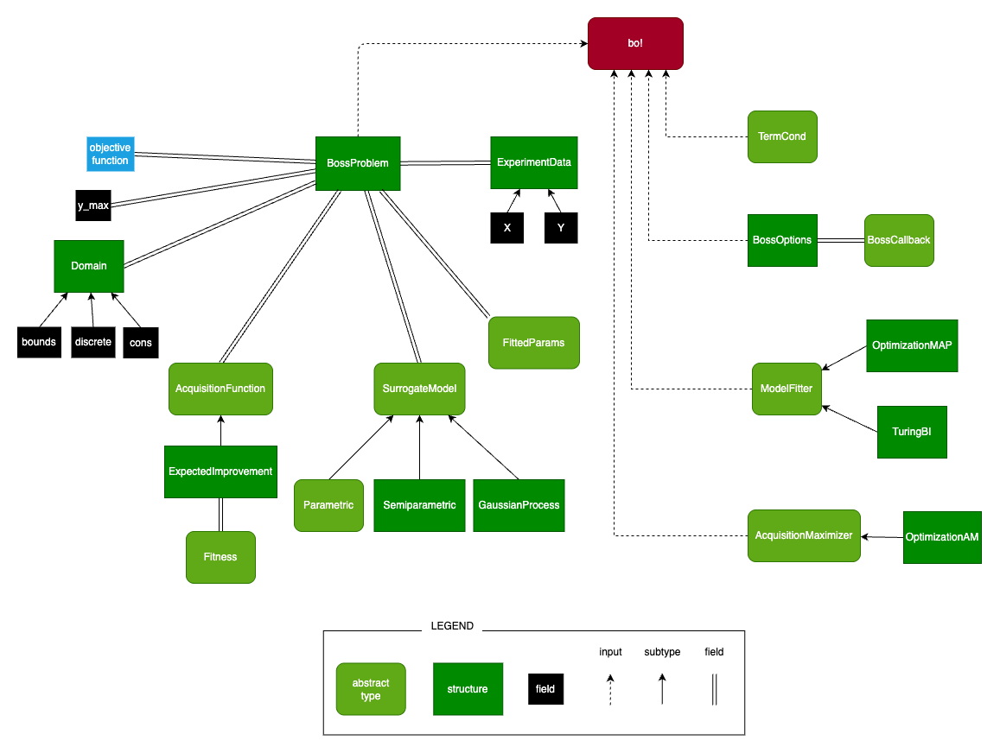

# Data Types & Structures

The following diagram showcases the hierarchy of the most important inputs & settings for the main function `bo!`.

| | | | | |
| --- | --- | --- | --- | --- |
| | |  | | |
| | | | | |

This reminder of this page contains documentation for all exported types and structures.

## Problem Definition

The [`BossProblem`](@ref) structure contains the whole optimization problem definition together with the surrogate model.

```@docs
BossProblem
```

## Input Domain

The [`Domain`](@ref) structure is used to define the input domain ``x \in \text{Domain}``. The domain is formalized as
```math
\begin{aligned}
& lb < x < ub \\
& d_i \implies (x_i \in \mathbb{Z}) \\
& \text{cons}(x) > 0 \;.
\end{aligned}
```

```@docs
Domain
AbstractBounds
```

## Output Constraints

Constraints on the output `y` can be defined using the `y_max` field of the [`BossProblem`](@ref). Providing `y_max` to [`BossProblem`](@ref) defines the linear constraints `y < y_max`.

Arbitrary nonlinear constraints can be defined by augmenting the objective function. For example to define the constraint `y[1] * y[2] < c`, one can define an augmented objective function
```julia
function f_c(x)
    y = f(x)  # the original objective function
    y_c = [y..., y[1] * y[2]]
    return y_c
end
```
and use
```julia
y_max = [fill(Inf, y_dim)..., c]
```
where `y_dim` is the output dimension of the original objective function `f(x)`. Note that defining nonlinear constraints this way increases the output dimension of the modeled objective function and thus the definition of the [`SurrogateModel`](@ref) has to be modified accordingly.

## Acquisition Function

The acquisition function is defined using the subtypes of `AcquisitionFunction`.

```@docs
AcquisitionFunction
```

Currently, only the expected improvement acuiqistion function is provided out-of-the-box.

```@docs
ExpectedImprovement
```

Custom acquisition functions can be defined by subtyping the [`AcquisitionFunction`](@ref) type.

## Fitness

Subtype of [`Fitness`](@ref) are used to define the fitness function ``\text{fit}(y) \rightarrow \mathbb{R}`` and is passed to the [`AcquisitionFunction`](@ref).

```@docs
Fitness
```

(Note that the acquisition function does not _have to_ include `Fitness`. For example, it may not make sense to include `Fitness` in specialized acquisition functions for active learning tasks. Acquisition function for optimization tasks should usually work with `Fitness`.)

The [`LinFitness`](@ref) can be used to define a simple fitness function depending linearly on the objective function outputs.
```math
\text{fit}(y) = \alpha^T y
```
Using [`LinFitness`](@ref) instead of [`NonlinFitness`](@ref) may allow for simpler/faster computation of some acquisition functions (if they are defined that way).

```@docs
LinFitness
```

The [`NonlinFitness`](@ref) can be used to define an arbitrary fitness function.
```math
\text{fit}(y) \rightarrow \mathbb{R}
```

```@docs
NonlinFitness
```

## Surrogate Model

The surrogate model is defined using subtypes of [`SurrogateModel`](@ref) and passed to the [`BossProblem`](@ref).

```@docs
SurrogateModel
```

Each subtype of [`SurrogateModel`](@ref) has its own subtype of [`ModelParams`](@ref) defined, which stores all its (hyper)parameters.

```@docs
ModelParams
```

The [`LinearModel`](@ref) and [`NonlinearModel`](@ref) structures are used to define parametric models.

(Some compuatations are simpler/faster with linear model, so the [`LinearModel`](@ref) might provide better performance in the future. This functionality is not implemented yet, so using the [`NonlinearModel`](@ref) is equiavalent for now.)

```@docs
Parametric
LinearModel
NonlinearModel
ParametricParams
```

The [`GaussianProcess`](@ref) structure is used to define a Gaussian process model. See [1] for more information about Gaussian processes.

```@docs
Nonparametric
GaussianProcess
GaussianProcessParams
```

The [`Semiparametric`](@ref) structure is used to define a semiparametric model combining the parametric and nonparametric (Gaussian process) models.

```@docs
Semiparametric
SemiparametricParams
```

Custom surrogate models can be defined by subtyping the [`SurrogateModel`](@ref) type.

## Model Posterior

The functions [`model_posterior`](@ref) and [`model_posterior_slice`](@ref) can be used to obtain an instance of the [`ModelPosterior`](@ref) and [`ModelPosteriorSlice`](@ref) structures.

```@docs
AbstractModelPosterior
ModelPosterior
ModelPosteriorSlice
```

## Model Parameters

The estimated model parameters are stored as subtypes of [`FittedParams`](@ref) in the `params` field of the [`BossProblem`](@ref).

```@docs
FittedParams
```

Different [`ModelFitter`](@ref)s create different subtypes of [`FittedParams`](@ref). For example, MAP model fitters result in the [`MAPParams`](@ref) containing the MAP [`ModelParams`](@ref), and variational model fitters results in the [`BIParams`](@ref) containing multiple posterior [`ModelParams`](@ref) samples.

```@docs
MAPParams
BIParams
RandomParams
FixedParams
```

## Experiment Data

The data from all past objective function evaluations are stored in the `ExperimentData` structure. It is also used to provide the intial training data to [`BossProblem`](@ref).

```@docs
ExperimentData
```

## Model Fitter

The `ModelFitter` type defines the algorithm used to estimate the model (hyper)parameters.

```@docs
ModelFitter
```

The `OptimizationMAP` model fitter can be used to utilize any optimization algorithm from the Optimization.jl package in order to find the MAP estimate of the (hyper)parameters. (See the example usage.)

```@docs
OptimizationMAP
```

The `TuringBI` model fitter can be used to utilize the Turing.jl library in order to sample the (hyper)parameters from the posterior given by the current dataset.

```@docs
TuringBI
```

The `SamplingMAP` model fitter preforms MAP estimation by sampling the parameters from their priors and maximizing the posterior probability over the samples. This is a trivial model fitter suitable for simple experimentation with BOSS.jl and/or Bayesian optimization. A more sophisticated model fitter such as `OptimizationMAP` or `TuringBI` should be used to solve real problems.

```@docs
SamplingMAP
```

The `RandomFitter` model fitter samples random parameter values from their priors. It does NOT optimize for the most probable parameters in any way. This model fitter is provided solely for easy experimentation with BOSS.jl and should not be used to solve problems.

```@docs
RandomFitter
```

The `SampleOptMAP` model fitter combines the `SamplingMAP` and `OptimizationMAP`. It first samples many model parameter samples from their priors, and subsequently runs multiple optimization runs initiated at the best samples.

```@docs
SampleOptMAP
```

Custom model fitters can be defined by subtyping the [`ModelFitter`](@ref) type.

## Acquisition Maximizer

The `AcquisitionMaximizer` type is used to define the algorithm used to maximize the acquisition function.

```@docs
AcquisitionMaximizer
```

The `OptimizationAM` can be used to utilize any optimization algorithm from the Optimization.jl package.

```@docs
OptimizationAM
```

The `GridAM` maximizes the acquisition function by evaluating all points on a fixed grid of points. This is a trivial acquisition maximizer suitable for simple experimentation with BOSS.jl and/or Bayesian optimization. More sophisticated acquisition maximizers such as `OptimizationAM` should be used to solve real problems.

```@docs
GridAM
```

The `SamplingAM` samples random candidate points from the given `x_prior` distribution
and selects the sample with maximal acquisition value.

```@docs
SamplingAM
```

The `RandomAM` simply returns a random point. It does NOT perform any optimization. This acquisition maximizer is provided solely for easy experimentation with BOSS.jl and should not be used to solve problems.

```@docs
RandomAM
```

The `GivenPointAM` always return the same evaluation point predefined by the user. The `GivenSequenceAM` returns the predefined sequence of evaluation points and throws an error once it runs out of points. These dummy acquisition maximizers are useful for controlled experiments.

```@docs
GivenPointAM
GivenSequenceAM
```

The `SampleOptAM` samples many candidate points from the given `x_prior` distribution,
and subsequently performs multiple optimization runs initiated from the best samples.

```@docs
SampleOptAM
```

The `SequentialBatchAM` can be used as a wrapper of any of the other acquisition maximizers. It returns a batch of promising points for future evaluations instead of a single point, and thus allows for evaluation of the objective function in batches.

```@docs
SequentialBatchAM
```

Custom acquisitions maximizers can be defined by subtyping the [`AcquisitionMaximizer`](@ref) type.

## Termination Conditions

The `TermCond` type is used to define the termination condition of the BO procedure.

```@docs
TermCond
```

The `NoLimit` can be used to let the algorithm run indefinitely.

```@docs
NoLimit
```

The `IterLimit` terminates the procedure after a predefined number of iterations.

```@docs
IterLimit
```

Custom termination conditions can be defined by subtyping the [`TermCond`](@ref) type.

## Miscellaneous

The `BossOptions` structure is used to define miscellaneous hyperparameters of the BOSS.jl package.

```@docs
BossOptions
```

The `BossCallback` type can be subtyped to define a custom callback, which is called in every iteration of the BO procedure (and once before the procedure starts). Pass the callback to the [`BossOptions`](@ref).

```@docs
BossCallback
NoCallback
```

The provided `PlotCallback` plots the state of the BO procedure in every iteration. It currently only supports one-dimensional input spaces.

```@docs
PlotCallback
```

# References

[1] Bobak Shahriari et al. “Taking the human out of the loop: A review of Bayesian
optimization”. In: Proceedings of the IEEE 104.1 (2015), pp. 148–175
